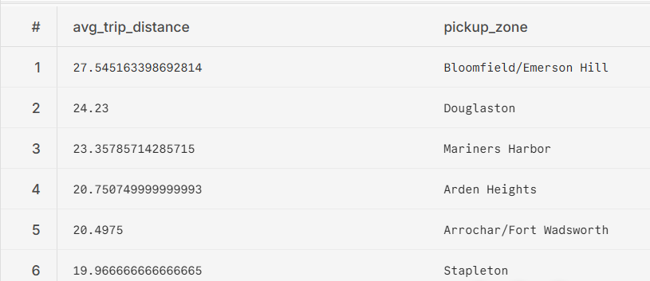

# Taxi Data Engineering Project (ELT)

ELT is preferred when the data is safe and cleaned enough to be put in a database, which means it will require less transformation. Feasibility of cloud is also a factor when choosing bewteen ELT and ETL.


## Loading

- loaded csvs for July and August Taxi data
- Similarly, for zone lookups

# Staging

 - Applied transformation like casting, relevant columns, trips with no passenger or zero fare.
 - Staged a model to combine July and August data sheets
 

## Checking staging 

```
select count(*) from dbt_zarshad_stg.stg_green_tripdata;
```

- After staging, we realised, we have too many unuseful columns.
- Business will help reduce that and simplify things for users as well as the organization

# Business Logic
- Bringing columns relevant to the user.
- Most business questions will be answered through this layer.

## Post Staging and Semantic Layers Lineage


## Business Questions
1- *How does revenue compare between July and August?*

The revenue increases almost 1.20%.


Using trip_date
- July - 892,549.76
- August - 903285.72
```


SELECT SUM(total_amount) AS july_rev
FROM dbt_zarshad_mart.fact_combined_trips
WHERE EXTRACT(MONTH FROM trip_date) = 7

```


2- *What are the top 10 pickup zones by revenue in each month?*

| #  | Revenue ($)        | Pickup Zone                   | Month |
|----|--------------------|-------------------------------|-------|
| 1  | 94.65              | East Harlem South             | 1     |
| 2  | 6.30               | Hunts Point                   | 1     |
| 3  | 4.80               | Crown Heights North           | 1     |
| 4  | 4.30               | Central Harlem                | 1     |
| 5  | 171.90             | Richmond Hill                 | 6     |
| 6  | 59.35              | Central Harlem                | 6     |
| 7  | 56.30              | Brownsville                   | 6     |
| 8  | 53.80              | East Harlem South             | 6     |
| 9  | 49.85              | Jamaica                       | 6     |
| 10 | 46.80              | Parkchester                   | 6     |
| 11 | 25.80              | East Williamsburg             | 6     |
| 12 | 15.80              | Stuyvesant Heights            | 6     |
| 13 | 117,716.67         | East Harlem North             | 7     |
| 14 | 107,180.95         | East Harlem South             | 7     |
| 15 | 56,994.98          | Central Harlem                | 7     |
| 16 | 41,432.52          | Washington Heights South      | 7     |
| 17 | 34,994.99          | Forest Hills                  | 7     |
| 18 | 31,634.62          | Central Harlem North          | 7     |
| 19 | 31,533.63          | Morningside Heights           | 7     |
| 20 | 24,007.98          | Downtown Brooklyn/MetroTech   | 7     |
| 21 | 23,188.25          | Fort Greene                   | 7     |
| 22 | 20,545.55          | Astoria                       | 7     |
| 23 | 118,387.30         | East Harlem North             | 8     |
| 24 | 105,106.01         | East Harlem South             | 8     |
| 25 | 58,267.00          | Central Harlem                | 8     |
| 26 | 42,916.36          | Washington Heights South      | 8     |
| 27 | 36,381.29          | Forest Hills                  | 8     |
| 28 | 33,729.42          | Morningside Heights           | 8     |
| 29 | 29,077.09          | Central Harlem North          | 8     |
| 30 | 26,546.71          | Downtown Brooklyn/MetroTech   | 8     |
| 31 | 23,828.72          | Central Park                  | 8     |
| 32 | 21,664.76          | Fort Greene                   | 8     |
| 33 | 85.25              | Flushing Meadows-Corona Park  | 9     |
| 34 | 18.05              | East Harlem North             | 12    |
| 35 | 11.30              | Morningside Heights           | 12    |


```
WITH win AS (
  SELECT 
    SUM(total_amount) AS rev, 
    pickup_zone, 
    EXTRACT(MONTH FROM trip_date) AS month, 
    ROW_NUMBER() OVER (
      PARTITION BY EXTRACT(MONTH FROM trip_date)
      ORDER BY SUM(total_amount) DESC
    ) AS row_number
  FROM 
    dbt_zarshad_mart.fact_combined_trips
  GROUP BY 
    pickup_zone, month
)

SELECT 
  rev, 
  pickup_zone, 
  month
FROM 
  win
WHERE 
  row_number <= 10
ORDER BY 
  month ASC, 
  rev DESC;


```

3- *Which zones show the largest increase/decrease in revenue between months?*

- Largest Decrease

    - Flushing Meadows-Corona Park
    - Elmhurst
    - Bay Ridge

- Largest Increase

    - East Harlem South
    - Central Harlem
    - Jamaica

```
WITH monthly_rev AS (
  SELECT 
    pickup_zone,
    EXTRACT(MONTH FROM trip_date) AS month,
    SUM(total_amount) AS rev
  FROM 
    dbt_zarshad_mart.fact_combined_trips
  GROUP BY 
    pickup_zone, EXTRACT(MONTH FROM trip_date)
),

monthly_diff AS (
  SELECT 
    curr.pickup_zone, 
    curr.month AS current_month,
    prev.month AS previous_month, 
    curr.rev AS curr_rev,
    prev.rev AS prev_rev,
    curr.rev - prev.rev AS rev_diff
  FROM 
    monthly_rev curr 
  JOIN 
    monthly_rev prev 
    ON curr.pickup_zone = prev.pickup_zone 
   AND curr.month = prev.month + 1
)

SELECT 
  * 
FROM 
  monthly_diff
ORDER BY 
  rev_diff 
LIMIT 10;

```


4 - *How do average tips vary by drop-off zone and month?*

- Average tips are zero in the months of 1, 6, 12 because there are no records.
- In 7, Newark Airport has the highest avg tip (14)
- In 8, Battery Park has the highest avg tip (6.12)
- In 9, 10.59 is the highest avg tip from Brooklyn Heights

```

SELECT 
  AVG(tip_amount) AS avg_tip,
  dropoff_zone,
  EXTRACT(MONTH FROM trip_date) AS month 
FROM 
  dbt_zarshad_mart.fact_combined_trips 
GROUP BY 
  dropoff_zone, EXTRACT(MONTH FROM trip_date)
ORDER BY 
  month, avg_tip DESC;

```

5- *What’s the average trip distance and fare per zone per month?*


```
SELECT 
  AVG(trip_distance) AS avg_trip_dist,
  AVG(fare_amount) AS avg_fare,
  pickup_zone,
  dropoff_zone,
  EXTRACT(MONTH FROM trip_date) AS month 
FROM 
  dbt_zarshad_mart.fact_combined_trips 
GROUP BY 
  dropoff_zone,
  pickup_zone,
  EXTRACT(MONTH FROM trip_date);

```

6 - *Do certain pickup zones consistently generate higher tips or longer rides?*


- Longer rides could mean time or distance, for now, I am using trip distance wrt to pickup zones. 

- Longer trips and higher distance seems to be unrelated




7 - *Is there a correlation between trip distance and tip amount across months?*

```
SELECT corr(trip_distance, tip_amount),
extract(month from trip_date) as month
FROM dbt_zarshad_mart.fact_combined_trips
group by month order by month;

```


8 - *What zones saw the largest drop in average revenue per trip month-over-month?*

- Astoria Park with a drop of -14


```

WITH monthly_avg_rev AS (
  SELECT 
    pickup_zone,
    EXTRACT(MONTH FROM trip_date) AS month,
    (AVG(total_amount)) AS avg_revenue_per_trip
  FROM 
    dbt_zarshad_mart.fact_combined_trips
  GROUP BY 
    pickup_zone, EXTRACT(MONTH FROM trip_date)
),

month_over_month_diff AS (
  SELECT 
    curr.pickup_zone,
    curr.month AS current_month,
    prev.month AS previous_month,
    curr.avg_revenue_per_trip AS current_avg_rev,
    prev.avg_revenue_per_trip AS previous_avg_rev,
    (curr.avg_revenue_per_trip - prev.avg_revenue_per_trip) AS diff
  FROM 
    monthly_avg_rev curr
  JOIN 
    monthly_avg_rev prev
    ON curr.pickup_zone = prev.pickup_zone
    AND curr.month = prev.month + 1
)

SELECT 
  pickup_zone,
  previous_month,
  current_month,
  previous_avg_rev,
  current_avg_rev,
  diff AS revenue_drop
FROM 
  month_over_month_diff
WHERE 
  diff < 0  -- only drops
ORDER BY 
  revenue_drop ASC  
LIMIT 10;

```

